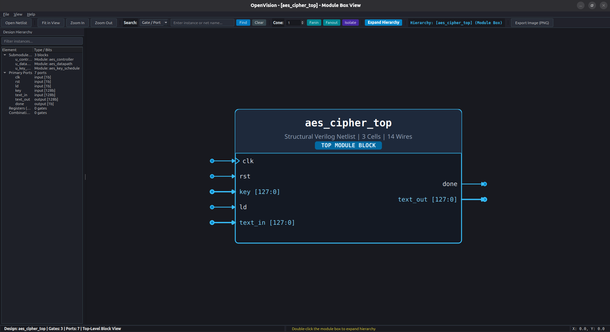

# OpenVision

[](https://www.python.org/)
[](https://www.linux.org/)
[](https://riverbankcomputing.com/software/pyqt/)
[]()
[]()
[](LICENSE)

OpenVision is an open-source schematic viewer and interactive visualization tool for technology-mapped gate-level digital netlists. It provides readable, publication-quality schematics matching commercial EDA standards.

Unlike generic graph visualizers, OpenVision renders gate-level netlists with authentic IEEE Std 91 logic gate shapes, clean Manhattan 90-degree orthogonal routing, multi-level hierarchical drill-down, and full-net interactive highlighting.



---

## Key Features

### 1. Hierarchical Exploration
Designs open in a clean, high-level Module Box view showing boundary input and output pins. Double-click any submodule box to descend into its interior logic. Ascend back to parent levels using the breadcrumb toolbar or the Escape key.


Expanding hierarchy reveals the top-level structural interconnect diagram with clear inter-module buses:


### 2. Standard IEEE Logic Symbols & Collision-Free Routing
- **Dynamic Boolean Classification:** Recognizes logic functions directly from PDK Liberty (`.lib`) timing equations.
- **IEEE Std 91 Shapes:** Authentic symbols for AND, NAND, OR, NOR, XOR, XNOR, MUX2, compact Inverters/Buffers, and D Flip-Flops with bottom clock triangles.
- **100% Collision-Free Manhattan Routing:** Inter-column channels and perimeter bypass corridors guarantee zero wire crossings over instance bodies.
- **Solder Dots & HFN Decoupling:** Solder dots (bullet markers) at branch points; high-fanout nets decoupled into named stubs.


### 3. Interactive Full-Net Highlighting
Hovering or clicking on any wire segment illuminates the entire electrical net from its source driver pin to every destination sink pin across all bends, branches, and solder dots, accompanied by detailed net metadata tooltips.


### 4. Logic Cone Tracing
- Trace backward combinational fanin cones and forward fanout cones.
- Automatic boundary stopping at flip-flop/register pins or primary ports.
- Isolate extracted logic cones for focused timing path inspection.

### 5. Multi-PDK Support & High-Resolution Export
- Out-of-the-box compatibility with SkyWater 130nm (`sky130_fd_sc_hd`, `sky130_fd_sc_hs`), GlobalFoundries 180nm (`gf180mcu`), Nangate 45nm, and IHP SG13G2.
- Export schematics directly to publication-ready high-resolution PNG images.

---

## Installation

### Prerequisites

- Linux (Ubuntu 22.04+ or Debian-based distributions recommended)
- Python 3.12 or newer
- OpenGL and X11 / Wayland runtime libraries for PyQt6

```bash
# On Ubuntu / Debian:
sudo apt-get update
sudo apt-get install -y python3 python3-pip python3-venv libgl1-mesa-glx libegl1 libxkbcommon-x11-0
```

### Setup

```bash
# Clone the repository
git clone https://github.com/keyurd1998-sys/OpenVision.git
cd OpenVision

# Create and activate virtual environment
python3 -m venv .venv
source .venv/bin/activate

# Install dependencies and OpenVision in editable mode
pip install -r requirements.txt
pip install -e .
```

---

## Usage

### Interactive GUI Viewer

Open a synthesized Verilog netlist with a PDK Liberty library:

```bash
openvision --netlist path/to/design.v --liberty path/to/pdk.lib
```

Example with the included AES benchmark:

```bash
openvision --netlist benchmarks/synth/aes_cipher_top.v
```

### Command-Line Logic Cone Tracing

Extract and export logic cones directly from the terminal without opening the GUI:

```bash
# Trace 4-level backward fanin cone of an instance and export image
openvision --netlist benchmarks/synth/aes_cipher_top.v \
           --fanin inst:_0514_ \
           --depth 4 \
           --export-cone fanin_cone.png

# Trace forward fanout cone from a primary input
openvision --netlist benchmarks/synth/aes_cipher_top.v \
           --fanout port_in:rst \
           --export-cone fanout_cone.png
```

### CLI Options

```
Options:
  -n, --netlist PATH     Path to structural gate-level Verilog file (.v)
  -l, --liberty PATH     Path to technology Liberty timing library (.lib)
  -t, --top TEXT         Top-level module name (defaults to auto-detected top)
  --fanin TEXT           Target instance or port ID for backward logic cone
  --fanout TEXT          Target instance or port ID for forward logic cone
  --depth INTEGER        Maximum traversal depth for cone tracing (default: unlimited)
  --export-image PATH    Export schematic directly to image file (PNG)
  --export-cone PATH     Export extracted logic cone to image file (PNG)
  --hfn-threshold INT    Fanout threshold for high-fanout net decoupling (default: 20)
  --help                 Show this help message and exit
```

---

## Running Tests

All unit, integration, and regression tests are managed through pytest:

```bash
# Run the complete test suite
pytest tests/ -v
```

The test suite covers:
- Benchmark synthesis and netlist parsing
- Dynamic Boolean equation symbol classification
- Sugiyama placement, cycle breaking, and ranking
- Manhattan orthogonal auto-routing and solder-dot detection
- Zero wire-instance collision assertions across hierarchical benchmarks
- Multi-PDK Liberty parsing (Sky130, Nangate45, GF180, IHP)
- Interactive PyQt6 GUI canvas, hover highlighting, and image export

---

## Project Structure

```
OpenVision/
├── openvision/
│   ├── ingestion/         # Verilog netlist and Liberty PDK parsers, symbol classifier
│   ├── placement/         # Sugiyama ranking, cycle breaker, crossing minimizer
│   ├── routing/           # Manhattan orthogonal router, HFN decoupler, solder dots
│   ├── cone/              # Logic cone extraction (fanin/fanout tracer)
│   ├── gui/               # PyQt6 canvas, IEEE gate items, wire items, main window
│   └── cli.py             # Unified command-line interface entry point
├── benchmarks/            # Benchmark RTL and synthesized reference netlists
├── tests/                 # Automated pytest test suite (45 tests)
├── Docs/                  # Documentation visual snapshots
│   └── snap/              # UI and schematic captures
├── requirements.txt       # Python package dependencies
├── setup.py               # Package distribution setup
└── README.md              # Project documentation
```

---

## License

This project is licensed under the Apache License, Version 2.0. See [LICENSE](LICENSE) for details.
